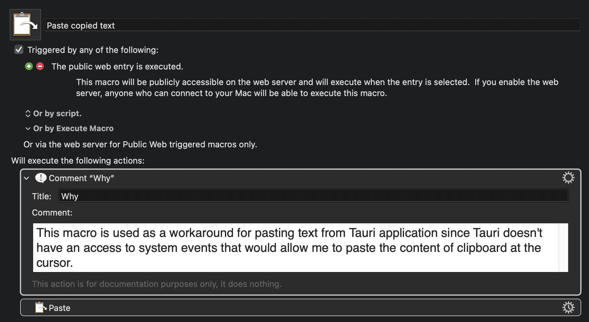

# justsayit

Inspired by [superwhisper](https://superwhisper.com/), definitely check it out if you're looking for something stable, polished and feature rich.

> [!WARNING]
>
> This code is **a mess**. It's a PoC where I'm constantly experimenting, changing things, and publishing everything as I go to test the app in action.
>
> You've been warned. Enter at your own risk.

## Roadmap

### v0

- [x] simple audio input
- [x] settings
  - [x] api keys
  - [x] format with AI toggle
  - [x] formatting preset selection (default, message, note, email)
  - [x] model selection
  - [x] persist settings
  - [x] language selection
- [x] auto update
- [x] tray icon menu
  - [x] quit
  - [x] settings
- [x] history (simple, stored in file system: audio + transcript + llm response)

### v0.1

- [x] REFACTOR

### v0.2

- [ ] deep link support
- [ ] retry mechanism
- [ ] tray menu action to open history file dir
- [x] paste text after processing
  - [ ] add config to disable pasting
- [ ] maybe this ai toggle is not needed now, one of the presets could be "no formatting"
- [ ] prevent sending empty messages (no audio)
- [ ] cancel recording
- [ ] add configs/presets/modes (need to decide on the name)
  - [ ] each config can have: formatting preset, ai model, language
  - [ ] choose one default config
  - [ ] assign shortcut to each config
- [ ] support local models

### v0.3

- [ ] webhooks - configure webhook and send transcript to it after processing

## Frontend Structure

The application follows a modular architecture with a clear separation between features and services:

- **Features**: Contain business logic and UI components for specific application features
- **Services**: Handle API interactions (Tauri, OpenAI, Grok, etc.) and provide a clean interface for features

```plaintext
src/
├── app.html
├── app.d.ts
├── routes/
│   ├── +layout.ts
│   ├── app/                         # Main app window
│   │   └── +layout.svelte
│   └── settings/                    # Settings window
├── lib/
│   ├── core/                        # Core functionalities
│   │   ├── types.ts
│   │   ├── constants.ts
│   │   ├── settings.ts
│   │   └── store.ts
│   ├── services/                    # Service layer for API interactions
│   │   ├── file-system.ts
│   │   ├── windows.ts
│   │   ├── clipboard.ts
│   │   ├── play-sound.ts
│   │   ├── transcription/
│   │   │   ├── index.ts
│   │   │   └── providers.ts         # Transcription providers (Grok, ...)
│   │   └── ai/
│   │       ├── index.ts
│   │       └── providers.ts         # AI providers (OpenAI, Anthropic, etc.)
│   ├── features/
│   │   ├── audio/                   # Audio recording and visualization
│   │   │   ├── recorder.svelte.ts
│   │   │   └── visualizer.svelte
│   │   ├── ai-formatting/           # AI text formatting
│   │   │   ├── formatting.ts
│   │   │   ├── presets.ts
│   │   │   └── prompts/
│   │   ├── app-updates.ts           # Automatic application updates
│   │   └── system-tray.ts           # System tray
│   ├── assets/
│   │   ├── sounds/
│   │   └── icons/
│   ├── global.css
│   └── ui/                          # (Future) Reusable UI components
│       └── components/              # (Future) UI component library
```

### Architectural Notes

- **Services Layer**: Introduced to handle API interactions and provide a clean interface for features
- **API Key Management**: API keys are stored in the central store and accessed directly by services for simplicity
- **Feature-Service Separation**: Features contain business logic while services handle external interactions
- **No Circular Dependencies**: Services are designed to avoid importing from one another

## Workarounds

### Pasting text at cursor

I wanted my app to work like [superwhisper](https://superwhisper.com/) - when you stop recording, the text should automatically appear where your cursor is. The app should copy the text to your clipboard AND paste it for you right away.

The problem is that Tauri (what I'm using to build this app) can't control your cursor to paste text.

My solution:

1. Use [Keyboard Maestro](https://www.keyboardmaestro.com/) as a helper
2. Set up Keyboard Maestro's web server
3. Create a macro with a web trigger that pastes clipboard content
4. Make my app send a request to this local web server when needed

To set this up yourself:

- Install Keyboard Maestro
- Turn on its web server feature
- Create a macro with a public web trigger (helpful video: https://www.youtube.com/watch?v=D0IqJt-H9xE)
- Connect from Tauri using the HTTP client plugin (docs: https://tauri.app/plugin/http-client/#usage)

Here's what my macro looks like:



## Deep Links

I'm experimenting with [Leader Key](https://github.com/mikker/LeaderKey.app) for combo keyboard shortcuts.

E.g. with my current setup I press my `leader key` then `j` to trigger `justsayit` layer and then:

- `l` to set language
  - `p` Polish
  - `e` English
- `a` to set AI formatting
  - `y` on
  - `n` off
- `p` to set formatting preset
  - `d` default
  - `m` message
  - `n` note
  - `e` email

## Resources

- https://github.com/open-webui/open-webui/blob/main/.github/workflows/build-release.yml - nice workflow
